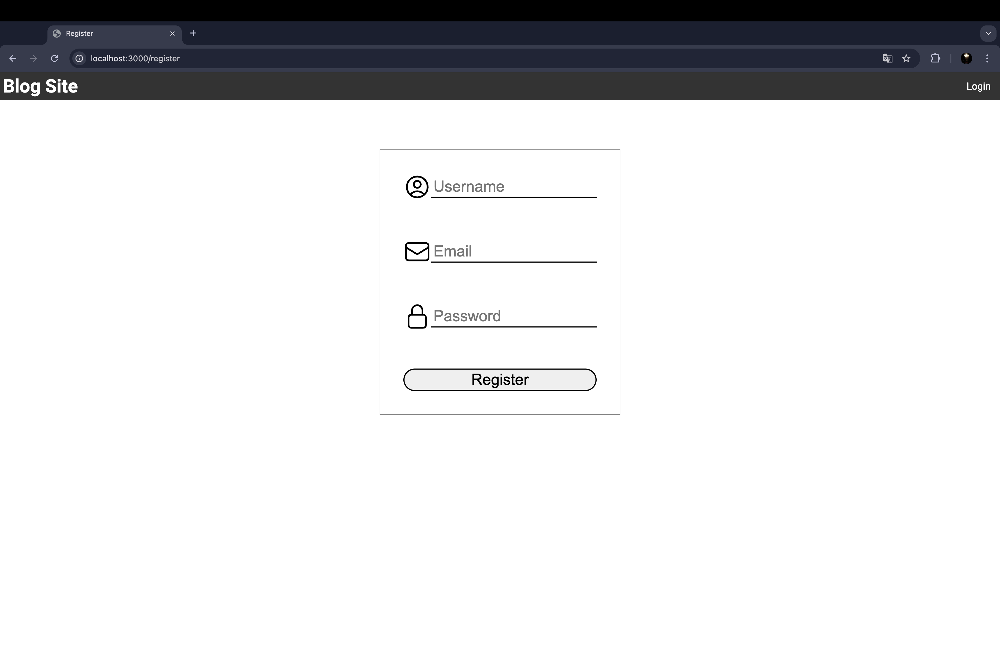
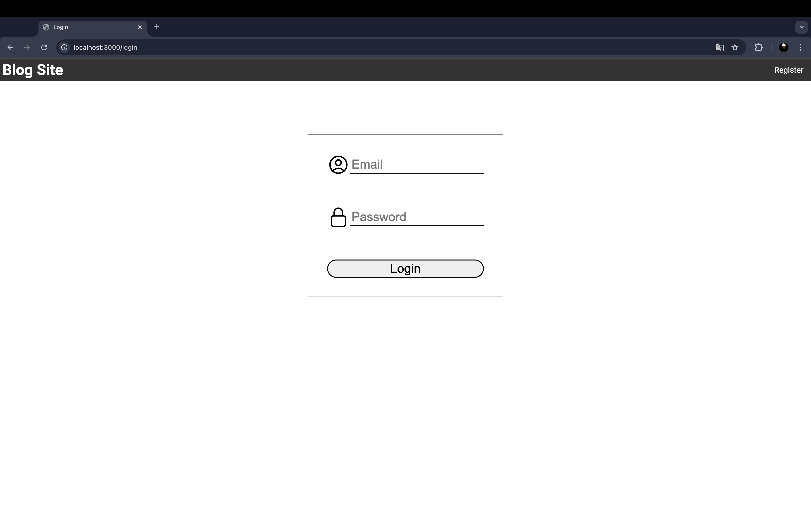
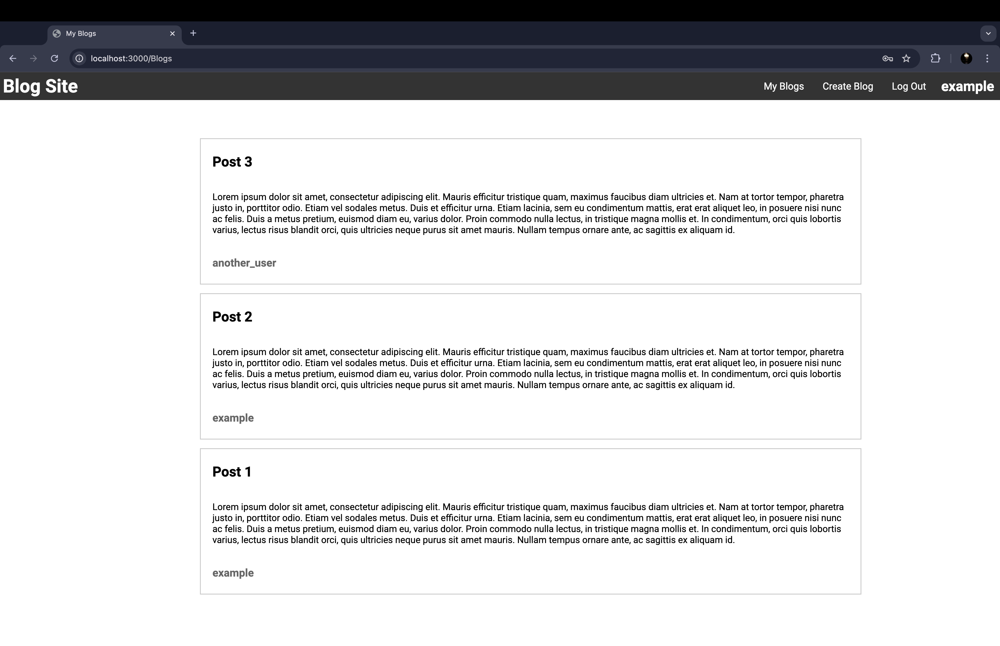
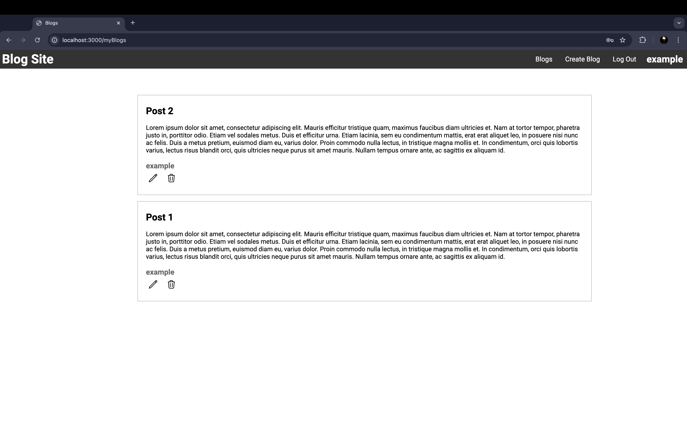
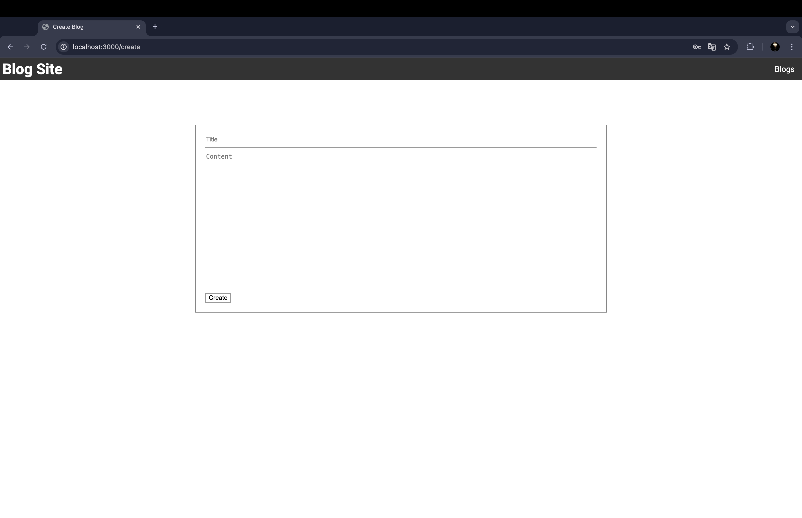

# Basit Bir Blog Sitesi

Bu proje, Node.js ve Express kullanarak oluşturulmuş basit bir blog sitesidir. EJS, JavaScript, HTML ve CSS kullanılarak geliştirilmiştir. Veritabanı olarak PostgreSQL kullanılmıştır. Projeyi yerel makinenize yükleyip çalıştırabilirsiniz.

## Kurulum

1. Repo'yu klonlayın:
   ```bash
   git clone https://github.com/Berkopan/Blog-Project
   ```

2. Proje dizinine gidin:
   ```bash
   cd Blog-Project
   ```

3. Gerekli bağımlılıkları yükleyin:
   ```bash
   npm install
   ```

4. PostgreSQL veritabanını kurun ve yapılandırın.

5. Veritabanını oluşturun ve aşağıdaki komutlar ile gerekli tabloları oluşturun:
   ```bash
   CREATE TABLE users (
   id SERIAL PRIMARY KEY,
   username VARCHAR(30) NOT NULL UNIQUE,
   email VARCHAR(255) NOT NULL UNIQUE,
   password VARCHAR(70) NOT NULL
   );

   CREATE TABLE blogs (
   id SERIAL PRIMARY KEY,
   user_id INT NOT NULL,
   username VARCHAR(30) NOT NULL,
   content TEXT NOT NULL,
   title VARCHAR(60) NOT NULL
   );
   ```
6. `.env` dosyasını oluşturun ve yapılandırın. Proje kök dizininde bir `.env` dosyası oluşturmanız gerekmektedir. Aşağıda örnek bir `.env` dosyası yapılandırması verilmiştir:
   ```
   USERNAME=database_server_username
   HOST=database_host
   DATABASE=database_name
   DBPASSWORD=database_password
   DBPORT=Database_port
   SALTROUNDS=number_of_salting
   ```
## Kullanım

1. Sunucuyu başlatın:
   ```bash
   npm start
   ```

2. Tarayıcınızda `http://localhost:3000` adresinde siteyi görüntüleyebilirsiniz.

## Sitenin Özellikleri

1. Güvenli kullanıcı kayıt ve giriş işlemleri. Kullanıcı şifreleri database'de hashlenerek korunur.
2. Kayıt olan herkes post paylaşabilir ve gönderilen postları görüntüleyebilir.
3. Kullanıcı kendi postlarını düzenleyebilir ve silebilir.

## Proje Görüntüleri

Aşağıda blog sitesinin bazı ekran görüntüleri bulunmaktadır:
### Register Sayfası

### Login Sayfası

### Ana Sayfa

### My Blogs Sayfası

### Create Post Sayfası


## Katkıda Bulunma

Katkıda bulunmak isterseniz, lütfen aşağıdaki adımları takip edin:

1. Repo'yu fork'layın.
2. Yeni bir branch oluşturun (`git checkout -b feature-branch`).
3. Değişikliklerinizi yapın ve commit'leyin (`git commit -am 'Add new feature'`).
4. Branch'ınızı push'layın (`git push origin feature-branch`).
5. Bir pull request oluşturun.

## Lisans

Bu proje MIT Lisansı altında lisanslanmıştır. Daha fazla bilgi için [LİSANS](LICENSE) dosyasına bakın.

## Yazarlar

- [Berkay SARICA](https://github.com/berkopan) - Proje sahibi ve baş geliştirici

---

Proje hakkında daha fazla bilgi veya yardım için lütfen iletişime geçmekten çekinmeyin.